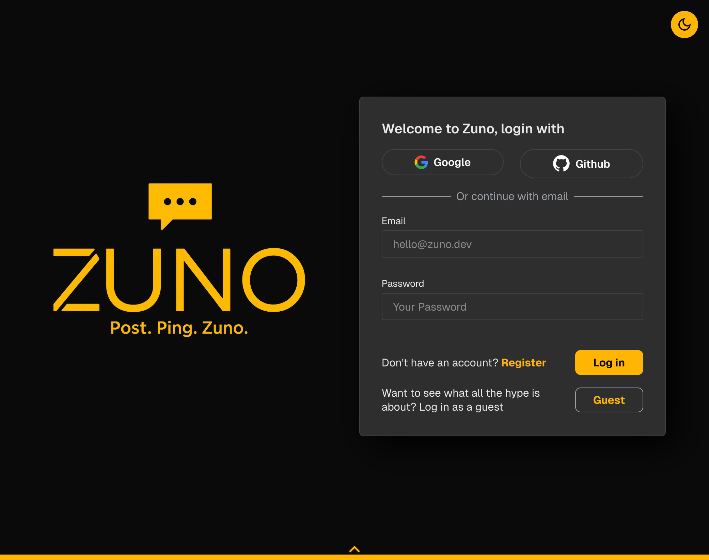
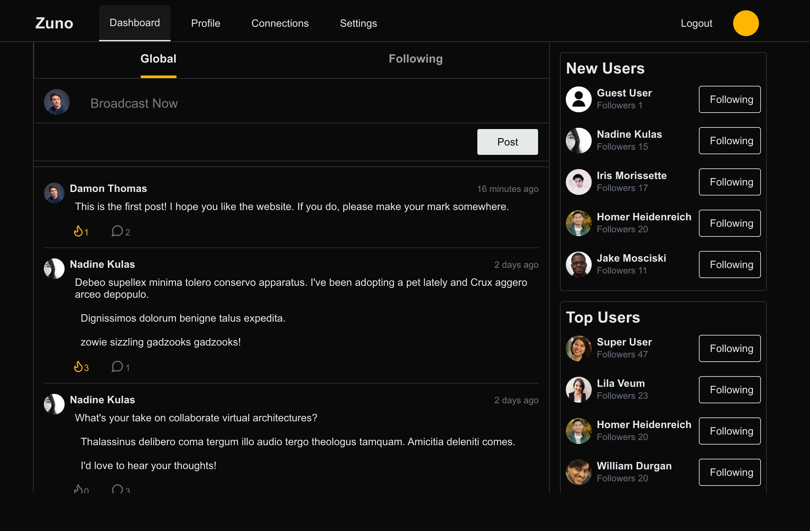
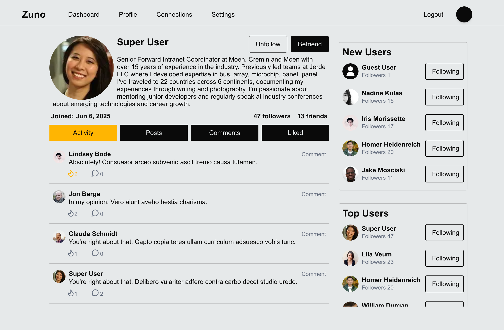

# [Zuno](https://zuno.damonthomas.dev/)

Try it out without signing up by using the guest account.  
Built as part of [The Odin Project’s Odin-Book assignment](https://www.theodinproject.com/lessons/node-path-nodejs-odin-book)

---

## Screenshots

### Login Page

### Dashboard

### Mobile View

.png)

### Profile Page

---

## Zuno 1.0

Due to time constraints, I had to delay a few features. This version is Zuno 1.0, and I plan to return to implement the rest. Future improvements include:

1. **Chat Functionality**  
   Currently, there's no real difference between a friend and a follower. The plan was for direct messages to be limited to friends only, but I had to cut the feature to hit my deadline. I’d like to implement real-time chat using websockets.

2. **Notification System**  
   Right now, notifications are limited to pending friend requests. I’d like to expand this to include activity on posts, new followers or friend requests, and chat messages.

3. **Image Handling**  
   OAuth provides profile pictures, but users should be able to upload custom profile images as well. I'd also like to support image messages in chat.

4. **Rich Text Editor**  
   Adding a rich text editor would let users better control the appearance of their posts.

5. **Minor Changes**
   - Expand the sidebar with more dynamic content.
   - Add deeper comment nesting and lazy loading for long threads.
   - Fix border overflow issues.
   - Improve comment order and sorting logic.

---

## Project Overview

Zuno has two main components:

1. **Website** – Built with Next.js and hosted on Railway
2. **Database** – PostgreSQL managed with Prisma ORM, also hosted on Railway

---

## Tech Stack

- React, Next.js, Tailwind
- Node.js, TypeScript
- PostgreSQL, Prisma ORM
- OAuth (GitHub + Google)

---

## Lessons Learned

### Infinite Comment Nesting

I’ve run into poor UX around deep nesting before, so I wanted a solution that felt intuitive. My goal was to support unlimited depth while keeping the UI clear and interactions simple.

I took inspiration from Reddit's thread lines. Their site also uses Tailwind, so I studied their approach and created a simpler version. Each comment is structured as a grid with four sections: avatar and username up top, a conditional thread line if replies exist, and the content itself. Replies are stacked with additional styling to render thread corners and hidden main lines. It’s responsive, looks clean, and adds clarity to the discussion flow. I’m proud of how it turned out.

### Deadlines and Prioritization

I set ambitious goals for this project, aiming to create something that clearly demonstrates I’d be an asset to any team. As the deadline approached, I realized I wouldn’t be able to finish everything — a situation I anticipated. That’s why I focused on core features first. Zuno 1.0 still meets my initial goal, and I’ll revisit it to polish and expand on what’s here.

### AI in My Workflow

I’ve used GitHub Copilot regularly over the last six months. It’s a powerful tool, but one that needs to be used deliberately. I also integrated Claude Sonnet 4 into Copilot's workflow during this project. Here’s what I’ve learned:

#### What Works Well:

- **Boilerplate Generation**: Repetitive patterns (e.g., multiple similar functions) are where Copilot shines.
- **Custom Search**: It often pulls in more relevant, contextual code examples than generic search engines.
- **Project Navigation**: It can quickly locate related files or implementations.
- **Idea Generation**: Useful for comparing approaches or confirming assumptions.
- **Animations**: Great for creating quick, modular animations that are easy to tweak.

#### What Doesn’t:

- **Outdated Info**: Its suggestions for third-party tools are often outdated. Reading the official docs is still essential.
- **Unrelated Code Changes**: Sometimes it aggressively rewrites code or formatting even when unprompted.
- **Context Blindness**: It struggles to track project-wide consistency — especially with complex systems like authentication or form state management.
- **Advanced Types**: It falls short when updating or managing complex TypeScript types.

#### Workflow Lessons:

- **Infinite Scrolling**: Copilot got the base implementation running, but maintenance became tricky because I hadn’t written it myself. In hindsight, doing it manually would’ve taken only slightly longer and resulted in better long-term understanding.
- **Authentication**: I asked too much from Copilot here. It repeatedly failed to implement Next.js OAuth correctly. After two wasted days, I did it myself in the same amount of time. Now I cap AI assistance at three unproductive prompts before switching to manual implementation.
- **useFormState Hook**: I tried using `useFormState` to manage form logic after reading the Next.js docs. Copilot kept rewriting everything to avoid it, even when I asked it not to. I suspect the hook just isn’t popular enough for it to recognize.
- **Email Notifications**: I used Copilot to quickly set up an email system that sends a notification when someone uses the site’s contact form. It got the job done fast, but the form logic wasn’t great. Letting AI run with its own approach is faster, but it comes with trade-offs.

### Styling the Website

I'm not a designer, and I didn’t design the layout from scratch. Instead, I pulled inspiration from existing platforms: the dashboard is modeled after X.com, the comment threads are inspired by Reddit, and the mobile navbar is similar to LinkedIn’s. The follow/friend logic is a hybrid of Facebook and LinkedIn.

What I did do was implement all of these design ideas myself (except for the Reddit-style thread lines, where I referenced their actual layout). This was the first time I intentionally styled a project from the start. The small touches — like the animated yellow underline under the Global and Following feed buttons — were fun to build and helped boost my confidence. I’m much more comfortable with implementation now, even if design isn’t my strength.

---
